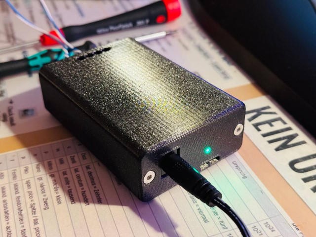
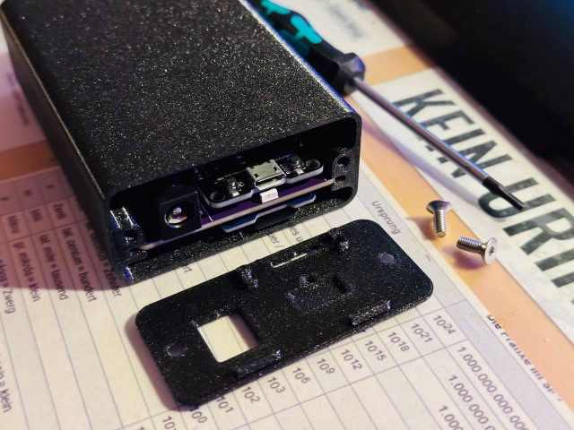
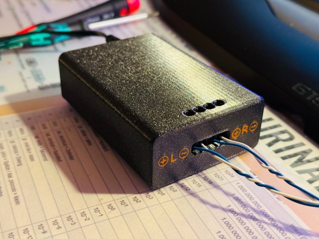
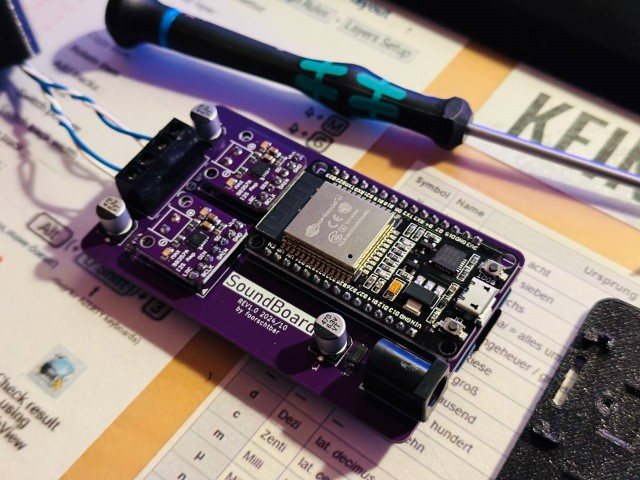

# SoundBoard

A simple PCB with two audio drivers, a SD card reader and a ESP32 microcontroller to play sounds via MQTT.

 
 
## Features
- On factory settings or no known WiFi SSID is found, device starts in AP mode
  - To stay in AP mode, leave the SSID and password empty
- The LED show the status of the device
  - `Orange`: Booting
  - `Blue`: Connecting to WiFi
  - `Green`: Connected to existing WiFi
  - `Violet`: Started WiFi AP
  - `Red`: No connection to WiFi
  - `White`: Web or MQTT activity
- The device can be controlled via MQTT:
  - Subscripte to `<prefix>/status` to get the status of the device
  - Publish to `<prefix>/cmd` to play a sound
    - `{"play": "filename.mp3", "volume": 50, "balance": 0}` (volume and balance are optional)
    - `{"tts": "Hello World", "lang": "de"}`

## Getting Started

- Default WiFi SSID: `SoundBoard`
- Default WiFi Password: `12345678x!`
  
## Hardware

### Case

- The case could be found on [Printables](https://www.printables.com/model/1072334-soundboard).

### PCB

- The PCB was designed with KiCad and could be found in the `pcb` directory.

## Development
### Frontend development

- Start the frontend development server with `python .\webserver.py` in the `html` directory.
- Open the browser at `http://localhost:8000/` to see the frontend.
- Set manual a cookie with `overwrite-host` to the hostname or ip of the device and reload the page.

### ToDos/Improvement Ideas

- [ ] Add a priority flag to the MQTT messages. Stop the current playback only if the priority is higher than the current one.
- [ ] Sync volume and balance fader across all clients
- [ ] Enable/Disable Playback/Stop buttons based on the current state
- [ ] Add addidtional MQTT topics with hostname for status und command
- [ ] Refactor Code in more separat files
- [ ] Maybe: Option to queue playbacks
- [x] Send file list in multiple messages
- [x] If we had valid settings, but in fallback AP mode, try to connect to the last known wifi periodically
- [x] Download audiofiles from the webinterface
- [x] Replace play/delete/download with icons?
- [x] Add tailing slash to the topic prefix
- [x] Save authentication in cookie/webstore
- [x] Add credentials to post requests
- [x] Improve MQTT reconnection and resubscription
- [x] Improve MQTT reconnection after boot when no connection is available
- [x] Make MQTT status topic more "chatty"

## Links
- [ESP32 Based Internet Radio using MAX98357A I2S Amplifier Board](https://circuitdigest.com/microcontroller-projects/esp32-based-internet-radio-using-max98357a-i2s-amplifier-board)
- [I2S Sound Tutorial for ESP32 - DIYI0T](https://diyi0t.com/i2s-sound-tutorial-for-esp32/)
- [schreibfaul1/ESP32-audioI2S: Play mp3 files from SD via I2S](https://github.com/schreibfaul1/ESP32-audioI2S)
- [ESP32 Pinout Reference: Which GPIO pins should you use? | Random Nerd Tutorials](https://randomnerdtutorials.com/esp32-pinout-reference-gpios/)
- [ESP32 partition calculator: Easily Calculate ESP32 Memory and Partition Sizes](https://esp32.jgarrettcorbin.com/)